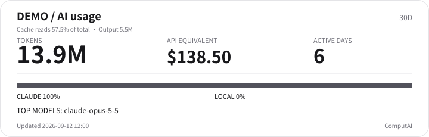
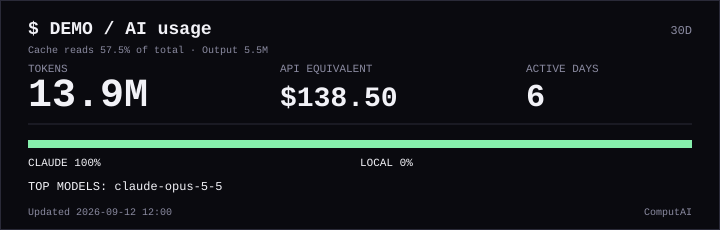
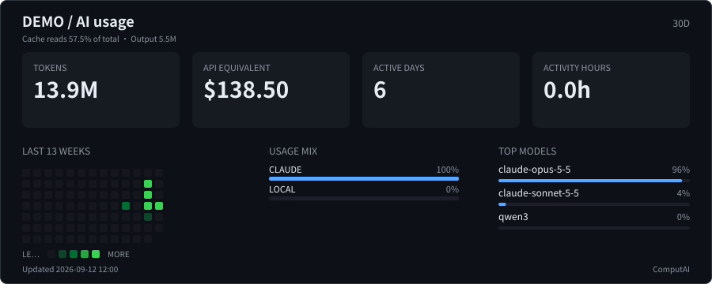
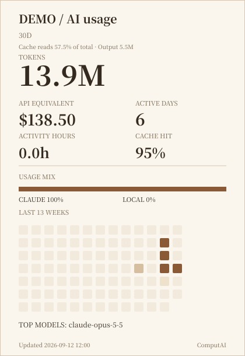
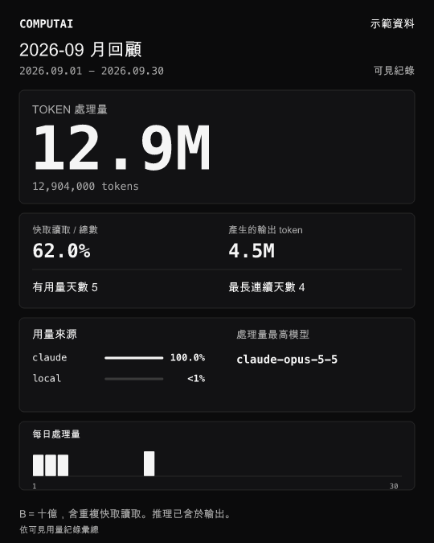

# ComputAI

**一眼看完你的算力和 AI 花費。** 用終端機 TUI 與瀏覽器 GUI，查看 AI 用量、訂閱額度、
本地推論與算力成本。Claude、Codex、homelab 和雲端 GPU 放在同一本帳裡：token、GPU 小時、度電和錢。

單一 Python 檔 · 只用標準函式庫 · Python 3.8+ · macOS、Linux、Windows

[English](README.md) · [快速開始](#快速開始) · [使用手冊](docs/MANUAL.zh-TW.md) · [版本說明](docs/RELEASE-v0.1.0-beta.md)

**目前版本：** [v0.1.0-beta.1](https://github.com/Sean-Hawks/computai/releases/tag/v0.1.0-beta.1)。
標示 **beta.2 開發版** 的功能可在這份開發分支使用。
也支援匯出[社群分享與 GitHub README 用量卡片](#圖卡與分享)。

## 監控介面

### 終端機 TUI

執行 `computai`，即時查看額度、機器、花費與警示。
用 `1`–`6` 或 `Tab` 切換總覽、額度、機器、本地模型、花費與時間軸；按 `q` 離開。


### 瀏覽器 GUI

執行 `computai --web`，開啟 `http://127.0.0.1:8765/`。
網頁從同一份帳本呈現用量圖表、機器狀態與警示，並支援手機排版。


兩張截圖均使用示範資料。加上 `--lang zh` 使用繁中介面，`--theme classic` 切換另一種監控主題。
若已安裝並登入 Tailscale，`computai --tailscale` 可透過 HTTPS 在自己的 tailnet 查看 GUI；
本機伺服器仍只監聽 `127.0.0.1`。

## 快速開始

### 安裝

macOS／Linux：安裝已釋出的 beta 到 `~/.local/bin/computai`：

```sh
curl -fsSL https://raw.githubusercontent.com/Sean-Hawks/computai/v0.1.0-beta.1/install.sh | sh
```

Windows：從[版本頁](https://github.com/Sean-Hawks/computai/releases/tag/v0.1.0-beta.1)下載並解壓 ZIP，在該資料夾執行：

```powershell
powershell -ExecutionPolicy Bypass -File install.ps1
```

請確認安裝目錄在 `PATH`；Windows 安裝後重新開啟終端機。
要使用這份開發版，macOS／Linux 在專案資料夾執行 `sh install.sh`，Windows 執行上面的 PowerShell 指令。
也可以直接執行單一檔案：`python3 ./computai`，Windows 用 `py -3 computai`。

### 啟動

```sh
computai --lang zh        # 終端機 TUI
computai --web --lang zh  # 瀏覽器 GUI：http://127.0.0.1:8765/
```

兩種介面可各自在一個終端機啟動。Claude Code、Codex 用量會從支援的本機紀錄自動偵測，
首次執行可能會詢問訂閱方案。網頁伺服器按 `Ctrl-C` 停止。

```sh
computai --setup         # 設定方案、機器、電價與選用 API 金鑰
computai --doctor        # 檢查偵測到的資料來源與缺少的設定
```

遠端機器、雲端供應商與 API 用量都是選用來源，可依自己的環境設定。

## 資料來源與功能

| 來源 | 讀取資料 | 看得到什麼 |
|---|---|---|
| **Claude Code／Codex** | 本機 session 用量紀錄；官方 CLI 額度查詢 | 各模型與專案的 token、快取與推理、訂閱額度及重置倒數 |
| **Gemini CLI／OpenCode／Cursor** | 本機紀錄、用量資料庫或匯出的 CSV | Token、模型比例、專案統計與 API 等值 |
| **本地模型** | Ollama、llama.cpp、vLLM、SGLang、LM Studio 與相容服務 | 載入的模型、已記錄 token、推論速度與模型閒置警示 |
| **機器** | 本機或 SSH + POSIX `sh` | CPU、GPU、功耗、度數與電費；遠端不需安裝 agent |
| **雲端 GPU** | RunPod、Vast.ai、Lambda 唯讀 API | 執行中的資源、每小時費用與閒置計費警示 |
| **組織 API** | 選用的 Anthropic／OpenAI admin API | 每個模型與每天的用量 |

成本分析包括快取效率、月底預測、預算、方案比較、GPU 回本與時間電價。
API 等值依設定價格估算，不是實際帳單。本地 token 的完整度取決於服務 metrics 或是否經過選用的計數 proxy。

## 常用指令

| 用途 | 指令 |
|---|---|
| 本月用量 | `computai --summary --month` |
| 依專案統計 | `computai --summary --month --by project` |
| Agent 活動時間軸 | `computai --timeline` |
| 預測與成本分析 | `computai --analyze` |
| 儲存 HTML 月報 | `computai --report --month 2026-09 --html september.html` |
| 探索可讀取的機器 | `computai --discover` |
| 統計本地推論 token | `computai --proxy` |
| 本地模型跑分 | `computai --bench` |
| 登入後通知額度變化 | `computai --install-watch` |
| 狀態列 | `computai --line` |

完整選項見 `computai --help`；資料來源設定與計數規則見[使用手冊](docs/MANUAL.zh-TW.md)。
網頁另提供 `/metrics`，可接 Prometheus。

多台電腦的用量整合見[多裝置設定](docs/MULTI-DEVICE.md)；
tmux、SwiftBar 與 Claude Code 見[狀態列整合](docs/one-line.md)。
Agent 分流（`--pick`）、MCP（`--mcp`）、週報與小隊總數也有手冊說明。

## 設定

第一次執行會建立 `config.ini` 與 `prices.ini`。用 `computai --paths` 查看設定檔與 SQLite 帳本位置。
macOS／Linux 預設設定目錄為 `~/.config/computai/`；Windows 使用應用程式資料目錄。
方案月費、API 價格與電價都可以自行修改，已查證價格附有日期。

```sh
computai --set general.lang=zh
computai --set general.theme=classic
```

`--setup` 提供引導設定，腳本可用 `--set`／`--unset`。
機器、金鑰、台電時間電價與整合參數見[設定檔說明](docs/MANUAL.zh-TW.md#設定檔)。

## 隱私與安全

- 只匯入用量欄位，帳本、報告與卡片不保存對話內容。
- 不讀 `~/.codex/auth.json` 或 Claude OAuth token；額度查詢使用官方 CLI 與它自己的登入。
- API 金鑰來自環境變數或限制權限的 `secrets.ini`（POSIX 為 `600`），不出現在 log、JSON、metrics 或錯誤訊息。
- 網頁與 proxy 預設只監聽 `127.0.0.1`；雲端與 admin API 整合使用唯讀查詢。
- 除非明確設定分享、遠端存取或發佈，用量與報告留在本機。監控介面與完整匯出可能包含專案、機器名稱；分享卡會排除這些欄位。

ComputAI 每天最多檢查一次更新，可用 `computai --set general.update_check=no` 關閉。
資料涵蓋範圍與平台限制見[beta 版本說明](docs/RELEASE-v0.1.0-beta.md#已知限制)。

## 開發版功能

這份分支另有 beta.2 功能，已釋出的 beta.1 尚未包含：

| 功能 | 說明 |
|---|---|
| Token 細項與本地請求紀錄 | [用量與追蹤](docs/MANUAL.zh-TW.md#token-細項與本地請求追蹤beta2-開發版) |
| 個人歷史、月報與年報 | [Profile 報告](docs/MANUAL.zh-TW.md#個人歷史-profilebeta2-開發版) |
| 瀏覽器製卡頁與四種新風格 | [下方圖卡說明](#圖卡與分享) |

## 圖卡與分享

把用量做成 README、作品集或社群貼文裡的圖卡，依版型與想呈現的資訊選擇設計。
圖卡使用本機彙總資料，不含對話、專案路徑或機器名稱。

| 設計 | 適合用途 | 預設版型 | 指令 | 可用版本 |
|---|---|---|---|---|
| **Minimal** | 用關鍵數字呈現簡潔的 README 橫幅 | `compact` · 720×230 | `--card --card-style minimal` | beta.2 開發版 |
| **Paper** | 襯線字體與直式用量摘要 | `portrait` · 420×610 | `--card --card-style paper` | beta.2 開發版 |
| **GitHub** | 統計方塊、活動圖與模型比例 | `dashboard` · 900×360 | `--card --card-style github` | beta.2 開發版 |
| **Terminal** | 等寬字體的終端機橫幅 | `compact` · 720×230 | `--card --card-style terminal` | beta.2 開發版 |
| **HUD** | Agent 活動、等級與徽章的完整個人頁 | `hud` · 900×390 | `--card --card-style netrunner` | beta.1 |
| **Web／TUI 分享卡** | 社群貼文、月回顧或 README 圖片 | 方形、直式、橫式或 README | `--create` · 下載 PNG／SVG | beta.2 開發版 |

月報會列出選定月份的來源日期、紀錄筆數和相鄰曆月比較，缺資料會提示而不冒充零用量。
先支援留有本機用量 log 的 Codex GUI／T3、本地模型及混合使用者；純網頁聊天暫不涵蓋。
也能從製卡頁下載只含所選區間的彙總 JSON。[月報來源與第一張圖卡](docs/MAKE-A-CARD.zh-TW.md#月報先確認什麼)。

<details>
<summary>查看六種設計的預覽（示範資料）</summary>

| Minimal · 簡潔橫幅 | Terminal · 終端機橫幅 |
|---|---|
|  |  |
| **GitHub · 活動統計面板** | **HUD · 完整 agent 個人頁** |
|  |  |
| **Paper · 直式摘要** | **Web／TUI · 社群分享** |
|  |  |

</details>

### 匯出圖卡

在這份開發版資料夾裡，有 Python 3.8+ 就能執行：

```sh
python3 ./computai --create --lang zh                # 選範圍，下載 PNG／SVG
python3 ./computai --card --card-style minimal --svg card.svg --lang zh
python3 ./computai --card --card-style paper --svg card.svg --lang zh
```

Windows 把 `python3 ./computai` 換成 `py -3 computai`；安裝後可直接用 `computai`。
把匯出的 SVG 放在 README 同一層，貼上：

```markdown

```

製卡頁使用 Web／TUI 設計，五種個人頁設計透過 `--card` 匯出 SVG。
請分享下載的圖片；製卡頁 HTML 內含可選歷史區間。[做第一張圖卡](docs/MAKE-A-CARD.zh-TW.md)。

### 調整版型

beta.2 開發版的 `--card-layout` 可選 `auto`（跟隨風格）、`compact`、`portrait`、`dashboard` 或 `hud`。
簡潔橫幅呈現關鍵數字，統計面板與直式另有活動圖與活動時數。
HUD 提供較完整的 agent 個人頁與裝飾動畫，其餘個人頁設計預設靜態。

```sh
computai --card --card-style github --card-layout compact --svg card.svg
computai --set card.style=paper --set card.layout=portrait  # 儲存預設，匯出與每日更新都沿用
```

每種個人頁設計都支援深／淺色（`--card-theme`）與英文／繁中標籤。
HUD 的配色選項為 `netrunner`（預設）、`arasaka`、`militech`、`amber`、`matrix`、`synthwave`，版型相同。
要在本機比較所有配色與版型，可用 `computai --card --html styles.html --lang zh`（beta.2 開發版）。
顯示名稱、自訂強調色與其他選項見[卡片參考](docs/MANUAL.zh-TW.md#個人頁卡片)。

### GitHub 個人頁更新

```sh
computai --card --setup
```

選用的精靈會設定個人頁 repo、產生深／淺色 SVG 配對，並加上 README 語法。
建立 repo、推送與背景更新由設定流程中的選項控制。
手動匯出用 `--card --svg`；`--card --publish PATH` 會寫入並 commit，加 `--push` 才推送。
詳見[個人頁設定](docs/MANUAL.zh-TW.md#自動更新的-github-個人頁卡片)與[卡片參考](docs/MANUAL.zh-TW.md#個人頁卡片)。

## 開發與回報

```sh
tests/run.sh                      # 單元測試；有 Python 3.8 時也會執行
python3 tests/e2e_ollama.py        # 選用 Ollama 端對端測試，需要 qwen3:0.6b
```

問題請透過 [GitHub issues](https://github.com/Sean-Hawks/computai/issues) 回報，附上版本、作業系統、
重現步驟與 `computai --doctor --redact` 的輸出。

## 授權與致謝

[MIT 授權](LICENSE)。機器取樣、GPU 偵測、網頁安全標頭與 Prometheus 輸出移植自
同一位作者的 [slurmtop](https://github.com/Sean-Hawks/slurmtop)，來源 commit 為 `84cd35d`。
