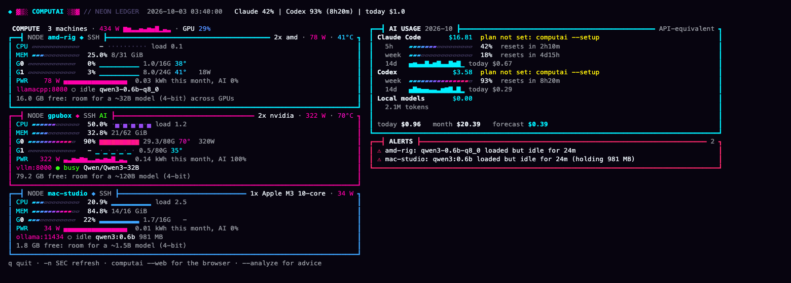

# ComputAI

**一眼看完你的算力和 AI 花費。** Claude、ChatGPT 訂閱，homelab 上的本地模型和機器，
租的雲端 GPU，放在同一本帳裡：token、GPU 小時、度電和錢。

[English](README.md) · [使用手冊](docs/MANUAL.zh-TW.md) · [Manual](docs/MANUAL.md)



`computai --web` 在瀏覽器看同樣的內容（也有手機排版），加上 `--lang zh` 就是中文介面：


*（截圖用的是示範資料。想要原本比較素的 slurmtop 樣式：`--theme classic` 或 `computai --set general.theme=classic`。）*

## 能做什麼

| | 資料來源 | 看得到什麼 |
|---|---|---|
| **訂閱** | 這台電腦上 Claude Code、Codex 的 session log | 每個模型的 token（快取、reasoning 分開）、照 API 價格換算的等值花費和月費比較、每個專案花多少、Codex 和 Claude 的額度與重置倒數 |
| **API** | Anthropic、OpenAI 的 admin 用量 API（可選） | 組織每天每個模型的用量 |
| **本地模型** | Ollama、llama.cpp、vLLM、SGLang、LM Studio、OpenAI 相容服務 | 載入了哪些模型、token 數（讀 `/metrics`，Ollama 靠可選的 `--proxy`）、「模型佔著記憶體卻沒在用」警示 |
| **機器** | SSH + `sh`（什麼都不用裝），或這台電腦 | CPU、GPU、功耗、度數、電費、AI 佔的時間比例、每個 token 幾焦耳 |
| **雲端 GPU** | RunPod、Vast.ai、Lambda（只呼叫唯讀 API） | 開著哪些機器、每小時多少錢，以及**閒著卻還在計費**的 GPU |

另外有快取效率分析（哪些 session 一直在重寫快取、多花了多少）、月底花費預測與預算警示、
方案模擬器、GPU 回本計算機、台電時間電價。

另外還有：`--discover` 從 `~/.ssh/config` 和 Tailscale 找機器；每台機器顯示還放得下多大的模型；
智慧插座（Shelly、Tasmota、Home Assistant）的實測功耗；`--wake` 遠端開機；`--mcp` 讓 agent 自己查預算；
`--weekly --send` 把週報送到 Discord 或 Telegram；`--recap` 年度回顧卡；`--csv` 匯出明細；
`--totals`／`--lab` 實驗室彙總；`--lang zh` 中文介面。

## 安裝

需要 Python 3.8 以上，只用標準函式庫；macOS、Linux、Windows 都可以。

```sh
sh install.sh        # macOS / Linux，裝到 ~/.local/bin/computai
```

```powershell
powershell -ExecutionPolicy Bypass -File install.ps1    # Windows
```

或者直接把 `computai` 這個檔案放到 `PATH` 裡任何地方。

## 設定成你自己的（兩分鐘）

```sh
computai --setup      # 一步一步：你的方案、Claude 額度、機器、功耗、電價、金鑰
computai --doctor     # 偵測到什麼、缺什麼，以及每一項要下的指令
computai              # 總帳畫面
```

Claude Code 和 Codex 的用量完全不用設定。`--setup` 一次問一件事，顯示目前的值或建議值（Enter 接受、`s` 跳過），
能從 log 判斷你的方案就先幫你選好，從 `~/.ssh/config` 和 Tailscale 找機器，依看到的硬體
（筆電或桌機、Apple 晶片等級、GPU 實測功耗）給功耗建議值，最後確認才寫入，而且會先備份。

所有設定都可以自己改 `~/.config/computai/config.ini`，或用指令改（不會弄丟註解）：

```sh
computai --set 'plans.claude=Claude Max 5x, 100, 2026-10-03' --set machine.wsl.base_watts=60
computai --unset plans.codex
computai --discover --add             # 把連得上的機器都加進來，附上功耗建議值
```

## 使用

```sh
computai                          # 終端機 live 畫面：算力／AI 用量／警示（按 q 離開）
computai --summary --month        # 這個月；--since 2026-09-01、--by project|day|session
computai --line                   # Claude 42%｜Codex 100% (1d0h)｜today $6.9
computai --analyze                # 預測、方案建議、快取浪費、電費
computai --web                    # http://127.0.0.1:8765/（手機排版）和 /metrics
computai --report --month 2026-09 --html september.html
computai --sample                 # 讀一次 [machines] 裡的每台機器
computai --cloud                  # RunPod / Vast.ai / Lambda
computai --proxy                  # 統計 Ollama 的 token：127.0.0.1:11435 -> :11434
computai --payback 1800 --gpu-watts 450
computai --discover               # 看看哪些機器讀得到
computai --once --lang zh         # 中文、印一次
```

每個指令都可以加 `--json`。第一次執行會在 `~/.config/computai/` 寫入 `config.ini` 和
`prices.ini`（位置用 `computai --paths` 看）；方案月費、機器、電價、API 價格都在裡面改，
每個價格都附查價日期。

台灣用戶：把 `config.ini` 的 `[power]` 改成 `tariff = tou`、`currency = TWD`，並設好
`[general] usd_to_local`（匯率），就會用台電簡易型二段式時間電價計算。預設數字沒能跟台電官網核對，
請對照你的電費單。

狀態列：tmux、SwiftBar 用 `computai --line`；Claude Code 的 statusLine 設成 `computai --statusline`
（Claude 的額度百分比只能從這裡取得）。見 [docs/one-line.md](docs/one-line.md)。

## 隱私與安全

- 只讀 log 裡的用量欄位，prompt 和回應不會讀進帳本、不會儲存、也不會傳到任何地方。
  不讀 `~/.codex/auth.json` 和 Claude 的 OAuth token。
- 金鑰只從環境變數或權限 600 的 `secrets.ini` 讀，不會出現在 log、`--json`、`/metrics` 或錯誤訊息裡。
- `--web` 和 `--proxy` 預設只聽 `127.0.0.1`；網頁伺服器會拒絕其他網域名稱的請求（防 DNS rebinding）。
- 雲端和 admin API 只會呼叫唯讀的「列出」請求。

## 測試

```sh
tests/run.sh                    # 單元測試（python3，以及有裝的話 Python 3.8）
python3 tests/e2e_ollama.py     # 端對端：真的 Ollama 接在 proxy 後面（需要 ollama 和 qwen3:0.6b）
```

## 致謝

機器取樣、GPU 偵測、網頁伺服器的安全標頭和 Prometheus 輸出移植自
[slurmtop](https://github.com/Sean-Hawks/slurmtop)（MIT，同一位作者，commit 84cd35d）。MIT 授權。
