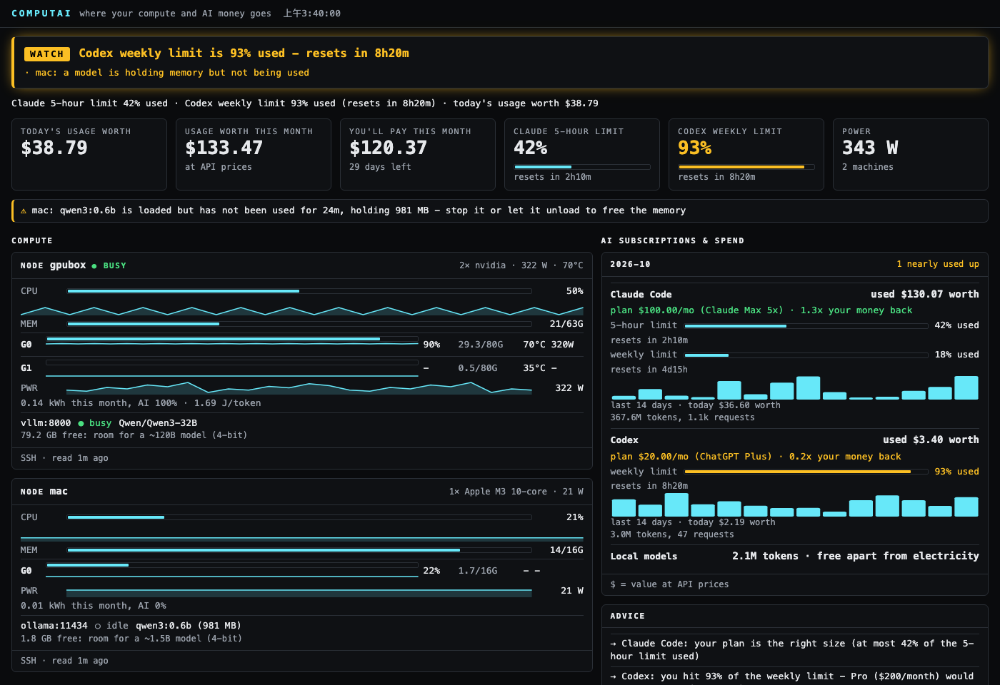
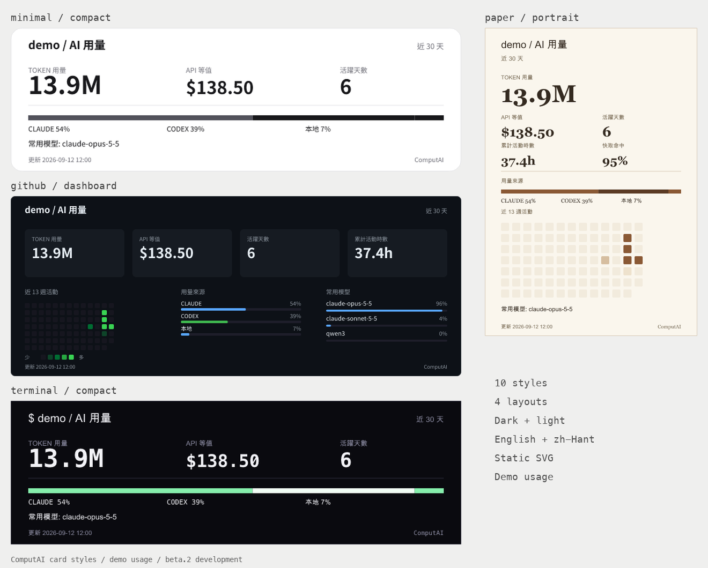

# ComputAI

**朋友試用 beta：** [v0.1.0-beta.1](https://github.com/Sean-Hawks/computai/releases/tag/v0.1.0-beta.1) · [安裝、限制與回報方式](docs/RELEASE-v0.1.0-beta.md)。下載安裝器會固定此測試版本。

**一眼看完你的算力和 AI 花費。** Claude、ChatGPT 訂閱，homelab 上的本地模型和機器，
租的雲端 GPU，放在同一本帳裡：token、GPU 小時、度電和錢。

[English](README.md) · [使用手冊](docs/MANUAL.zh-TW.md) · [Manual](docs/MANUAL.md) · [ComputAI 出現在哪裡](docs/SURFACES.md)

> **想把自己的 AI 用量貼到 Threads 或 README？**
> beta.2 開發版：`computai --create --lang zh` → 選範圍／版型 → 下載 PNG／SVG。[做第一張圖卡](docs/MAKE-A-CARD.zh-TW.md)。
> 尚未安裝這份開發版，在資料夾裡執行 `sh install.sh --create`；已釋出的 beta.1 尚未包含製卡頁。


`computai --web` 在瀏覽器看同樣的內容（也有手機排版），加上 `--lang zh` 就是中文介面：



*（截圖用的是示範資料。預設的 `cyber` 主題照 [docs/DESIGN.md](docs/DESIGN.md) 設計：最上面一行先告訴你有沒有事，顏色只用來表達意思。想要 slurmtop 樣式：`--theme classic` 或 `computai --set general.theme=classic`。）*

## 能做什麼

| | 資料來源 | 看得到什麼 |
|---|---|---|
| **訂閱** | 這台電腦上 Claude Code、Codex 的 session log | 每個模型的 token（快取、reasoning 分開）、照 API 價格換算的等值花費和月費比較、每個專案花多少、Codex 和 Claude 的額度與重置倒數 |
| **API** | Anthropic、OpenAI 的 admin 用量 API（可選） | 組織每天每個模型的用量 |
| **本地模型** | Ollama、llama.cpp、vLLM、SGLang、LM Studio、OpenAI 相容服務 | 載入了哪些模型、token 數（讀 `/metrics`，Ollama 靠可選的 `--proxy`）、「模型佔著記憶體卻沒在用」警示 |
| **機器** | SSH + `sh`（什麼都不用裝），或這台電腦 | CPU、GPU、功耗、度數、電費、AI 佔的時間比例、每個 token 幾焦耳 |
| **雲端 GPU** | RunPod、Vast.ai、Lambda（只呼叫唯讀 API） | 開著哪些機器、每小時多少錢，以及**閒著卻還在計費**的 GPU |

另外有快取效率分析（哪些 session 一直在重寫快取、多花了多少）、月底花費預測與預算警示、
方案模擬器、GPU 回本計算機、台電時間電價。

不知道該把任務丟給 Claude、Codex 還是本地模型？`$(computai --pick) "幫我整理這個 PR"` 會優先用快重置還沒用完的額度、
避開會提早用完的，輕量任務丟給本地模型。

在好幾台電腦上用 Claude 或 Codex？設一個共用資料夾（`[devices] folder`）或用 SSH 拉，帳本就會把每台都算進來，
只交換用量數字（[做法](docs/MULTI-DEVICE.md)）。

另外還有：`--discover` 從 `~/.ssh/config` 和 Tailscale 找機器；每台機器顯示還放得下多大的模型；
智慧插座（Shelly、Tasmota、Home Assistant）的實測功耗；`--wake` 遠端開機；`--mcp` 讓 agent 自己查預算；
`--weekly --send` 把週報送到 Discord 或 Telegram；`--wrapped` 像 Spotify Wrapped 的故事頁和分享卡、`--card` GitHub 個人頁卡片（`--recap` 是較早的年度回顧卡）；`--csv` 匯出明細；
`--totals`／`--lab` 實驗室彙總；`--lang zh` 中文介面。

## beta.2 本地開發版可試的新功能

`computai --tokens --lang zh` 解釋總數的快取／輸出細項；卡片也附快取占比說明。
`computai --statusline` 在 Claude Code 旁顯示模型、上下文與上次請求；`--statusline-view compact` 保留原本單行。
`computai --proxy --tag test` 記錄新請求耗時與 HTTP 結果，`computai --local-requests --lang zh` 查看。
只有經過新版 proxy 的新請求有詳細資訊，不保存提示詞／回應。這些仍是未發佈的本地開發功能，
[用法與統計定義](docs/MANUAL.zh-TW.md#token-細項與本地請求追蹤beta2-開發版)。

## 安裝

需要 Python 3.8 以上，只用標準函式庫；macOS、Linux、Windows 都可以。

```sh
sh install.sh        # macOS / Linux，裝到 ~/.local/bin/computai
```

```powershell
powershell -ExecutionPolicy Bypass -File install.ps1    # Windows
```

或者直接把 `computai` 這個檔案放到 `PATH` 裡任何地方。

## 設定成你自己的（兩分鐘）

```sh
computai --setup      # 一步一步：你的方案、Claude 額度、機器、功耗、電價、金鑰
computai --doctor     # 偵測到什麼、缺什麼，以及每一項要下的指令
computai              # 總帳畫面
```

Claude Code 和 Codex 的用量完全不用設定。`--setup` 一次問一件事，顯示目前的值或建議值（Enter 接受、`s` 跳過），
能從 log 判斷你的方案就先幫你選好，從 `~/.ssh/config` 和 Tailscale 找機器，依看到的硬體
（筆電或桌機、Apple 晶片等級、GPU 實測功耗）給功耗建議值，最後確認才寫入，而且會先備份。

所有設定都可以自己改 `~/.config/computai/config.ini`，或用指令改（不會弄丟註解）：

```sh
computai --set 'plans.claude=Claude Max 5x, 100, 2026-10-03' --set machine.wsl.base_watts=60
computai --unset plans.codex
computai --discover --add             # 把連得上的機器都加進來，附上功耗建議值
```

## 使用

```sh
computai                          # 終端機 live 畫面：1-6 切分頁（總覽、額度、機器、本地模型、花費、時間軸），q 離開
computai --summary --month        # 這個月；--since 2026-09-01、--by project|day|session
computai --line                   # Claude 42%｜Codex 100% (1d0h)｜today $6.9
computai --analyze                # 預測、方案建議、快取浪費、電費
computai --web                    # http://127.0.0.1:8765/（手機排版）和 /metrics
computai --tailscale              # 同一個網頁，用 Tailscale 安全地開到你自己的手機和電腦（HTTPS）
computai --report --month 2026-09 --html september.html
computai --profile --html profile.html --who hawks --lang zh  # beta.2：累計用量、可切換月報／年報
computai --sample                 # 讀一次 [machines] 裡的每台機器
computai --cloud                  # RunPod / Vast.ai / Lambda
computai --proxy                  # 統計 Ollama 的 token：127.0.0.1:11435 -> :11434
computai --local-history --lang zh # beta.2 開發分支：最近本地用量，區分逐筆請求與取樣差值
computai --payback 1800 --gpu-watts 450
computai --discover               # 看看哪些機器讀得到
computai --bench                  # 每個本地模型的速度和每百萬 token 電費
computai --install-watch          # 額度快用完、用完、重置時通知我（登入就在背景跑）
computai --once --lang zh         # 中文、印一次
computai --wrapped 2026-09        # 像 Spotify Wrapped 的月回顧（給 2026 就是整年）
computai --wrapped --html story.html --svg card.svg   # 限時動態風格網頁 + 1200x630 分享卡
computai --card --svg card.svg    # 放在 GitHub 個人頁 README 的小卡片（--card-theme light 淺色）
computai --card --publish ~/Documents/me   # 把卡片 commit 進你的個人頁 repo（沒加 --push 不會推出去）
```

每個指令都可以加 `--json`。第一次執行會在 `~/.config/computai/` 寫入 `config.ini` 和
`prices.ini`（位置用 `computai --paths` 看）；方案月費、機器、電價、API 價格都在裡面改，
每個價格都附查價日期。

台灣用戶：把 `config.ini` 的 `[power]` 改成 `tariff = tou`、`currency = TWD`，並設好
`[general] usd_to_local`（匯率），就會用台電簡易型二段式時間電價計算。預設數字沒能跟台電官網核對，
請對照你的電費單。

狀態列：tmux、SwiftBar 用 `computai --line`；Claude Code 的 statusLine 可以設成 `computai --statusline`。
見 [docs/one-line.md](docs/one-line.md)。Claude 的額度百分比會自己從 `claude` 程式讀（不用設 statusLine），
所以在 T3 Code、別台電腦用的也算得到。

## 個人用量 Profile、月報與年報（beta.2 開發版）

`computai --profile --html profile.html --lang zh` 把已匯入的歷史做成一份本機網頁。用滑鼠切換月份或年份，
查看精確 token 組成、每日處理量、常用模型、來源占比與有用量的天數；可切換深／淺色或列印。
`--profile 2026-09`、`--profile 2026` 指定開啟時的報告，`--who NAME` 加上顯示名稱，`--json` 匯出彙總。

適合以 GUI 使用 agent 的人：報告讀既有帳本與本機用量 log，不需要 Claude Code CLI 的狀態列。
來源代表紀錄格式，無法區分 T3、Codex GUI 等操作介面；未留下或未匯入的歷史不會補算。
每個來源都有涵蓋日期，進行中的月份／年份與較晚才開始的歷史會標示。**B 是十億，包含重複快取讀取；推理已含在輸出。**

頁面只有日期、用量、來源與模型，不含對話內容、專案路徑、機器位址或 session。
API 等值只按目前設定的價格估算已定價部分，不是實際帳單。預設只更新本機 log，不呼叫 API、SSH 或模型；
加 `--no-sync` 可只讀帳本。單一 HTML 包含所有可見區間，留在本機，沒有自動發佈；已釋出的 beta.1 尚未包含此功能。

最簡單的做法是 `computai --create --lang zh`：同頁預覽、切換範圍和下載，也能做 README 橫幅。
圖卡採用 Web／TUI 的黑白圓角面板，有深淺色；第一張圖不需要設定 GitHub 或常駐更新。
月報會列出選定月份的來源日期、紀錄筆數和相鄰曆月比較，缺資料會提示而不冒充零用量。
先支援留有本機用量 log 的 Codex GUI／T3、本地模型及混合使用者；純網頁聊天暫不涵蓋。
也能從製卡頁下載只含所選區間的彙總 JSON。[月報來源與第一張圖卡](docs/MAKE-A-CARD.zh-TW.md#月報先確認什麼)。

需要腳本匯出單張時：

```sh
computai --profile --share-layout square --html share.html --svg share.svg --lang zh
computai --profile 2026-09 --share-layout portrait --html month-share.html --lang zh
computai --profile 2026 --share-layout wide --svg year-share.svg --lang zh
```

`square` 為 1080×1080、`portrait` 為 1080×1350、`wide` 為 1200×630。分享頁可按「下載 PNG 圖卡」直接儲存原尺寸圖片，
也可下載 SVG。圖上有精確日期、快取占比、輸出與活動天數；直式另有用量趨勢。
分享 SVG／HTML **只包含選定區間**，沒有嵌入其他月份；不顯示帳單或推測工作能力。
`--svg` 也會啟用圖卡模式；同時輸出 HTML 時會是單張分享頁。沒加這兩個選項的 HTML 仍是完整歷史頁。
分享圖預設採用 Web／TUI 的克制風格；`--card-style amber` 等明確選項才使用既有 HUD 風格，
不自動繼承舊 card.style／colors，也不修改原本設定。製卡頁 HTML 是私人工具，請只分享下載的 PNG／SVG。

## GitHub 個人頁的 AI 作戰卡

一張放在個人頁 README（`github.com/<帳號>/<帳號>`）的 cyberpunk 卡片，展示 AI agent 怎麼替你工作：用了多少 token、工作了幾小時、同時跑幾個、用哪些模型。

卡片在你自己的電腦上，用你自己的 Claude Code 和 Codex log 產生，每天更新一次。不經過任何網路服務，也不上傳任何東西。



### 快速開始

```sh
curl -fsSL https://raw.githubusercontent.com/Sean-Hawks/computai/main/install.sh | sh
computai --card --setup
```

`--card --setup` 會問幾個問題，其他都自動處理：

1. 在本機找你的個人頁 repo。
   - 還沒 clone：用 `gh` 幫你 clone。
   - GitHub 上還沒有：提議幫你建立，你說好才會建。
2. 選主題。
3. 產生第一張卡片並 commit。
4. 把卡片加進 README。
5. 要的話直接推上去。
6. 問要不要每天在背景自動更新（`computai --install-watch`）。

Claude Code 和 Codex 不用任何設定，只要在這台電腦上用過，卡片就有資料。

### 卡片上有什麼

| 區塊 | 意思 |
|---|---|
| **Token** | 近 30 天流過 agent 的所有 token（輸入、快取、輸出）。 |
| **照 API 價格／方案回本** | 這些 token 照 API 定價（`prices.ini`）值多少，以及訂閱回本了幾倍。 |
| **Agent 工時** | agent 真正在工作的時間。同一個 session 裡間隔 5 分鐘以內的算進去，停更久的不算。 |
| **最多同時** | 同一時間最多有幾個 agent session 在工作。 |
| **最長連續** | 單一 session 中間沒有停超過 5 分鐘的最長一段。 |
| **快取命中** | 輸入裡有多少比例由 prompt 快取提供。越高越省錢、越快。 |
| **活動 // 13 週** | 13 週每天一格，最亮的是你最忙的日子。 |
| **艦隊** | Claude Code、Codex、本地模型各佔多少。 |
| **等級** | 用累計 token 算的等級（百萬為單位開根號，越後面越難升）。稱號依序是 INITIATE、PROMPT RUNNER、CONTEXT HACKER、CACHE WEAVER、TOKEN ALCHEMIST、NETRUNNER、GHOST IN THE SHELL、AI OVERLORD。 |
| **請求／子代理** | 送出的請求數，以及有派出子代理的 session 數。 |
| **裝備** | 最常用的三個模型和佔比。 |
| **事實列** | 作息（夜貓子、早起的鳥、朝九晚五、夜晚駭客）、高峰時段、目前連續天數、快取省下的錢。 |
| **徽章** | 依真實資料解鎖，見下方。 |
| **脈搏線** | 數據下方那條線是近 30 天每天的用量。 |

徽章的解鎖條件：

- **100M／1B／10B CLUB**：累計 token 達到門檻。
- **STREAK xN**：連續 7 天以上。
- **作息徽章**：顯示你的作息類型。
- **CACHE LORD**：快取省下 $1,000 以上。
- **HOMELAB**：用過本地模型。
- **POLYGLOT**：3 個以上的模型各佔 5% 以上。
- **MAXED OUT**：有額度用到 100%。

### 主題

beta.2 開發版新增四種風格，可搭配不同版型；已發佈的 beta.1 尚未包含。

| 風格 | 視覺與預設版型 |
|---|---|
| `minimal` | 灰階、留白、簡潔橫幅（`compact`） |
| `paper` | 暖色紙張、襯線字體、直式摘要（`portrait`） |
| `github` | 統計方塊、活動圖、模型比例（`dashboard`） |
| `terminal` | 等寬字、平直邊框、靜態橫幅（`compact`） |



```sh
computai --card --html styles.html --lang zh            # 本機比較 10 種風格的深／淺色與各版型
computai --card --card-style minimal --svg card.svg
computai --card --card-style paper --card-theme light --svg card.svg
computai --card --card-style github --card-layout compact --svg card.svg
computai --set card.style=paper --set card.layout=portrait  # 每日更新也沿用
```

`--card-layout` 可選 `auto`（跟隨風格）、`hud`（900×390）、`compact`（720×230）、`dashboard`（900×360）、`portrait`（420×610）。
風格決定配色與字體，版型決定尺寸和資訊安排；CLI 選項優先於 `[card]` 設定。
橫幅只顯示 token、API 等值、活躍天數、來源比例和常用模型；統計面板與直式另含活動圖及活動時數。
新風格預設靜態；原本六種風格保留 HUD 與裝飾動畫：

| `arasaka` | `militech` |
|---|---|
|  |  |
| `synthwave` | `matrix` |
|  |  |
| `amber` | 淺色模式 |
|  |  |

```sh
computai --set card.style=arasaka                 # netrunner（預設）、arasaka、militech、amber、matrix、synthwave
computai --set 'card.colors=#ff6b6b, #ffd93d'     # 自訂兩個強調色
computai --set card.handle=NEO                    # SYS. 後面的名字（預設是你的 GitHub 帳號）
computai --set card.lang=zh                       # 卡片語言（en、zh）
computai --set card.credit=no                     # 拿掉右下角的 GEN BY COMPUTAI
```

每個主題都有淺色版（`computai-card-light.svg`）。README 的程式碼片段會讓用淺色模式的訪客看到淺色版。

### 自動更新、手動產生、寫進腳本

`computai`、`computai --web` 或背景程式每天會重寫兩張卡片並 commit。`push = yes` 時，會先接上機器人推的 commit 再推上去。設定在 `config.ini`：

```ini
[card]
repo = ~/Documents/you/assets   ; 個人頁 repo 裡放卡片的資料夾
period = 30d                    ; 30d、month、year、all
push = yes
style = netrunner
```

```sh
computai --card --svg card.svg                       # 只產生卡片（--card-theme light、--period year）
computai --card --publish ~/Documents/you/assets     # 寫入兩張卡片並 commit（不推）
computai --card --publish ~/Documents/you/assets --push
```

`--card --setup` 加進 README 的程式碼片段：

```html
<a href="https://github.com/Sean-Hawks/computai">
  <picture>
    <source media="(prefers-color-scheme: light)" srcset="assets/computai-card-light.svg" />
    
  </picture>
</a>
```

### 卡片上有什麼、沒有什麼

- **有**：總數、模型名稱、你的 GitHub 帳號、最後更新時間。
- **絕對沒有**：專案名稱、資料夾路徑、session ID、機器名稱、對話內容。
- **會執行的東西**：只有對你自己的個人頁 repo 下 `git` 指令，不會傳到任何其他地方。
- **SVG 本身**：沒有腳本、沒有外部資源。動畫（故障抖動、掃描、游標）只是裝飾，沒有它們卡片也完整；訪客設了「減少動態效果」就會停。

### 疑難排解

- **卡片顯示 NO SIGNAL**：這台電腦上找不到 Claude Code 或 Codex 的用量。`computai --doctor` 會告訴你它去哪裡找。
- **卡片不再更新**：再執行一次 `computai --install-watch`。macOS 的紀錄在 `~/.local/share/computai/watch.log`。
- **推不上去**：git 要能推到你的個人頁 repo（`gh auth login` 或 SSH 金鑰）。修好之後執行一次 `computai --card --publish <資料夾> --push`。
- **GitHub 上字型看起來不一樣**：卡片指定 JetBrains Mono，訪客沒有這個字型時會用他自己的等寬字型。

## 其他 agent

除了 Claude Code 和 Codex，也會讀 Gemini CLI（`~/.gemini/tmp/*/chats`）、OpenCode（`~/.local/share/opencode/opencode.db`）
和 Cursor（帳號頁匯出的用量 CSV，`computai --import-cursor 檔案` 或 `[cursor] exports`）。一樣只取用量欄位。

## 隱私與安全

- Claude 整個帳號的額度是問官方的 `claude` 程式（`claude -p /usage`，本機指令，不呼叫模型）：平常每 10 分鐘一次，燒得快時最短每分鐘一次，重置後 30 秒再多查一次。登入由它自己處理，ComputAI 只拿百分比和重置時間，報告裡的其他內容一律不看（`[claude] poll_minutes = 0` 關掉）。
- Codex 整個帳號的額度（每台電腦、每個人用的都算）是問官方的 `codex` 程式（`codex app-server` 的 `account/rateLimits/read`），查詢頻率同樣跟著消耗速度走。登入由它自己處理，ComputAI 只拿到百分比和重置時間（`[codex] poll_minutes = 0` 關掉）。
- 只讀 log 裡的用量欄位，prompt 和回應不會讀進帳本、不會儲存、也不會傳到任何地方。
  不讀 `~/.codex/auth.json` 和 Claude 的 OAuth token。
- 金鑰只從環境變數或權限 600 的 `secrets.ini` 讀，不會出現在 log、`--json`、`/metrics` 或錯誤訊息裡。
- `--web` 和 `--proxy` 預設只聽 `127.0.0.1`；網頁伺服器會拒絕其他網域名稱的請求（防 DNS rebinding）。
- 雲端和 admin API 只會呼叫唯讀的「列出」請求。
- 給人看的指令一天最多一次讀 GitHub 上 `computai` 檔案的開頭 2 KB，看有沒有新版。不會送出任何關於你或用量的資料；
  `[general] update_check = no`（或 `COMPUTAI_NO_UPDATE_CHECK=1`）關掉。

## 測試

```sh
tests/run.sh                    # 單元測試（python3，以及有裝的話 Python 3.8）
python3 tests/e2e_ollama.py     # 端對端：真的 Ollama 接在 proxy 後面（需要 ollama 和 qwen3:0.6b）
```

## 致謝

機器取樣、GPU 偵測、網頁伺服器的安全標頭和 Prometheus 輸出移植自
[slurmtop](https://github.com/Sean-Hawks/slurmtop)（MIT，同一位作者，commit 84cd35d）。MIT 授權。
